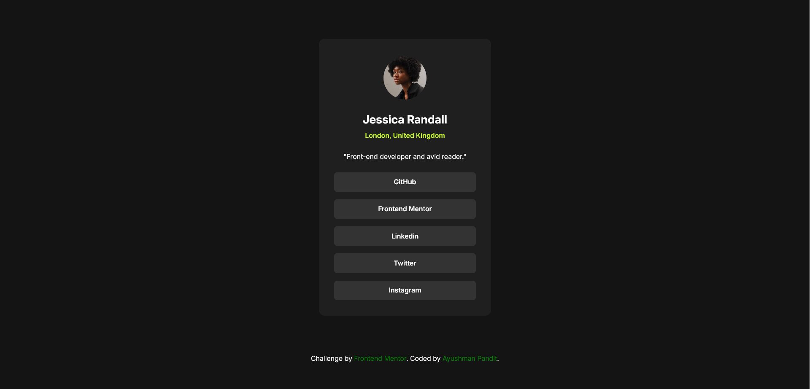

# Frontend Mentor - Social links profile solution

This is a solution to the [Social links profile challenge on Frontend Mentor](https://www.frontendmentor.io/challenges/social-links-profile-UG32l9m6dQ). Frontend Mentor challenges help you improve your coding skills by building realistic projects.

## Table of contents

-   [Overview](#overview)
    -   [The challenge](#the-challenge)
    -   [Screenshot](#screenshot)
    -   [Links](#links)
-   [My process](#my-process)
    -   [Built with](#built-with)
    -   [What I learned](#what-i-learned)
    -   [Continued development](#continued-development)
-   [Author](#author)

## Overview

### The challenge

Users should be able to:

-   See hover and focus states for all interactive elements on the page

### Screenshot

### Links

-   Solution URL: (https://github.com/AyushmanPandit/Social-Links-Profile)
-   Live Site URL: (https://ayushmanpandit.github.io/Social-Links-Profile/)

## My process

-   First, I reviewed the given designs to me and planned accordingly what elements should I create and what classes should I assign to them
-   Then, I wrote the html for the website with the planned classes
-   Next, I referred to the style guide and checked for the fonts used, the colors that were employed and then added those to the style sheet.
-   After that, I styled all the elements section-wise one by one until I was satisfied with the section before moving on to the next one.
-   FInally, I reviewed my website, compared it with the designs given and made minute changes for it look as close to the original as possible.

### Built with

-   Semantic HTML5 markup
-   CSS custom properties
-   Flexbox

### What I learned

While I didn't learn anything new while building this project, I revised the concepts that I already know and gained more confidence in designing the website, thus, polishing my skills even further. This project also helped me further strengthen my knowledge of flexbox.

### Continued development

For a short while, I will be continuing with practicing HTML and CSS, before moving on to more complex projects. Once I'm completely comfortable with HTML and CSS and their concepts like Flex, Grid etc., I will learn JS and tackle challenged involving JS.

## Author

-   Frontend Mentor - [@AyushmanPandit](https://www.frontendmentor.io/profile/AyushmanPandit)
